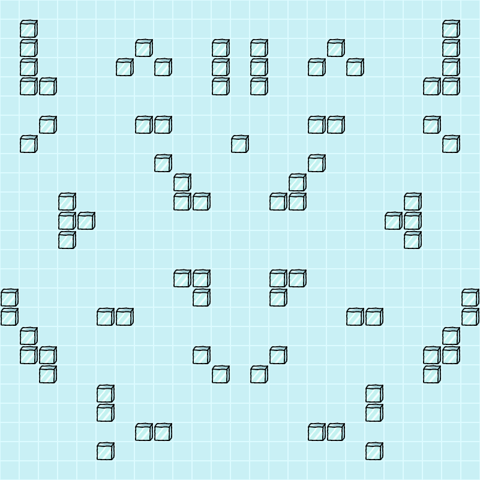

=======================
Instructions de mission
=======================

FIXME: ajouter des images de l'interface de jeu (case libre, mur, agents,
aliens, actions, drapeau débug, etc.)

-------
Iceberg
-------

Dans le cadre de votre mission, vous serez envoyé au Pôle Sud, plus exactement
sur cet icerberg - oui, celui-ci - où nos services de renseignements ont indiqué
que l'invasion alien débutera. L'iceberg est représenté par une grille carrée de
``TAILLE_ICEBERG`` cases de côté.

Cases
=====

Chaque case de l'iceberg est soit libre, soit un mur de glace. Les murs sont des
obstacles et bloquent tout déplacement sur la case.

Une case libre peut contenir un alien ainsi qu'un agent. À noter qu'il est
impossible d'avoir plusieurs agents sur une même case.

Agents
======

Les deux recrues PiB ont à leur disposition ``NB_AGENTS`` agents. Ces derniers
sont considérés comme des obstacles, et bloquent donc tout déplacement sur la
case.

Aliens
======

Des aliens débarqueront sur l'iceberg à des positions précises de la carte,
pendant un certain nombre de tour. Pour capturer un alien, un agent doit être
sur la case pendant au moins ``NB_TOURS_CAPTURE`` tours. Si l'agent quitte la
case (en se déplaçant ou alors en étant poussé par un agent), la capture devra
reprendre de zéro.

Les aliens faisant des efforts admirables pour éviter les agents - contrairement
aux murs, qui sont davantage récalcitrants - ils esquiveront de leur mieux : ce
ne sont donc pas des obstacles, et ne bloquent pas le déplacement des agents.

---------------------
Déroulement d'un tour
---------------------

Il y a ``NB_TOURS`` tours par partie, numérotés de 0 à ``NB_TOURS`` - 1. Pendant
un tour les recrues jouent alternativement. Les invasions aliens ont toujours
lieu en début de tour avant les actions des joueurs. En revanche, la capture des
aliens se fait toujours à la fin du tour, lorsque les deux recrues ont fini de
jouer.

Tous les agents se voient attribuer ``NB_POINTS_ACTION`` au début de chaque
tour. Ces points ne sont utilisables que durant ce tour et sont spécifiques à un
agent (il est donc impossible de transférer des points d'un agent à un autre).
Les points vous permettent d'effectuer les actions ci-dessous.

Actions
=======

Déplacer
--------

Vous pouvez déplacer un agent vers une case adjacente dans la direction de votre
choix. Cette action coûte ``COUT_DEPLACEMENT`` points d'action à l'agent.

Glisser
-------

Un agent peut s'élancer fougueusement sur l'iceberg, directement sur le ventre,
dans une certaine direction, ce qui le propulse jusqu'à ce qu'il heurte un
obstacle (un autre agent ou un mur). L'action coûte ``COUT_GLISSADE`` points
d'action.

Pousser
-------

Il est possible de pousser un autre agent si ce dernier est sur une case
adjacente à l'un de vos propres agents. Le pousser dans une direction le fait
glisser jusqu'à ce qu'il rencontre un obstacle. Pousser un agent coûte
``COUT_POUSSER`` points d'action.

Débug
-----

Pour vous permettre de débugger votre intelligence artificielle, il est possible
de placer des drapeaux de débug sur la carte que vous pourrez ainsi voir dans
l'interface de jeu. Cette action ne coûte aucun point d'action.

Score
=====

Chaque alien capturé vous rapporte un certain nombre de points en fonction de
l'alien, selon son espèce, le danger brut qu'il représente, et ses opinions
politiques. La recrue ayant accumulé le plus de points à la fin de la partie
sera déclarée vainqueur.

Format de la carte
==================

La carte de l'iceberg est représentée dans un fichier texte qui suit le format
suivant :

::

  iceberg ASCII
  positions depart agents joueur 1
  positions depart agents joueur 2
  description aliens

La représentation ASCII de l'iceberg est constituée de ``.`` pour une case libre
et ``X`` pour un mur.

Pour chaque joueur, ``NB_AGENTS`` lignes indiquent la position de départ d'un
agent sous la forme ``ligne colonne``.

La description des aliens commencent par un nombre sur une seule ligne indiquant
le nombre d'aliens qui envahiront l'iceberg durant la partie. Chaque ligne
précise ensuite les caractéristiques d'un alien :
``position_ligne position_colonne points_capture tour_invasion duree_invasion``
